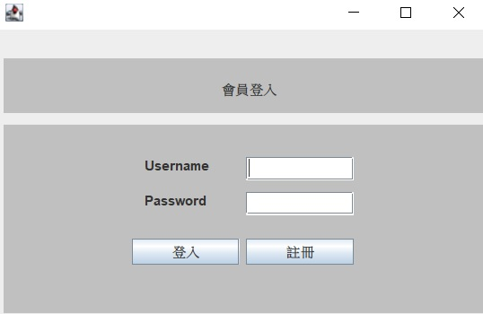

# GJun Java full-stack training course - Homework4
### 利用Java串接MySQL，並使用SQL語法操作資料，建立簡易訂單系統。
### 技術與工具清單
- java jdk11
- java JFrame
- MySQL
- dao design pattern
- jdbc

### 系統操作簡易說明
#### 登入畫面

##### 登入失敗：提示需註冊會員
##### 登入成功

#### 註冊新會員
##### 註冊會員驗證規則
###### 規則1：輸入帳號須至少3個全英文數字
###### 規則2：輸入手機號碼須符合台灣手機格式(09xxxxxxxx)

#### 新增訂單
##### 顯示訂單
##### 產生訂單明細

#### 訂單維護
##### 查詢訂單
##### 修改訂單
##### 刪除訂單