# GJun Java full-stack training course - Homework4
### 使用Java程式設計語言進行系統介面設計以及利用DAO設計模式、MVC架構，透過JDBC串接MySQL資料庫，並使用SQL語法操作資料，建立簡易訂單系統。
### 技術與工具清單
- java jdk11
- java JFrame
- MySQL v8.0.4
- dao design pattern
- MVC structure(Model–view–controller)
- jdbc

### 系統操作簡易說明
#### 登入畫面

##### 登入失敗：提示需註冊會員

##### 登入成功
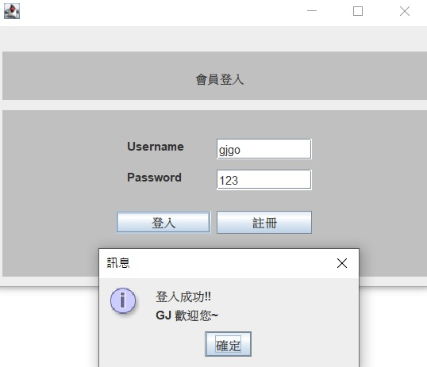
#### 註冊新會員
##### 註冊會員驗證規則
###### 規則1：輸入帳號須至少3個全英文數字
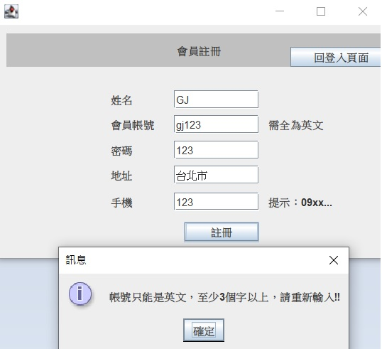
###### 規則2：輸入手機號碼須符合台灣手機格式(09xxxxxxxx)

###### 註冊成功

#### 訂單主畫面
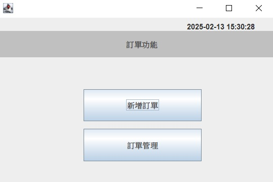
##### 顯示訂單
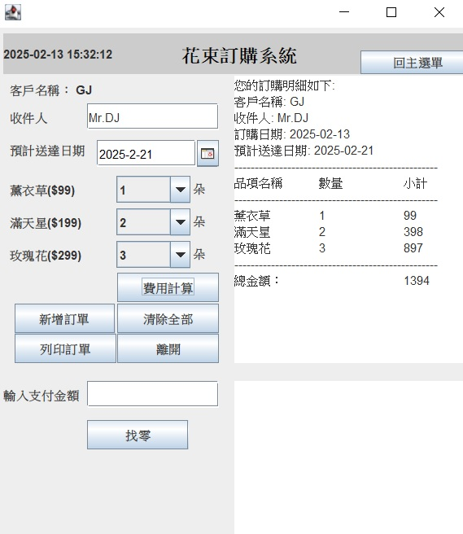
##### 新增訂單
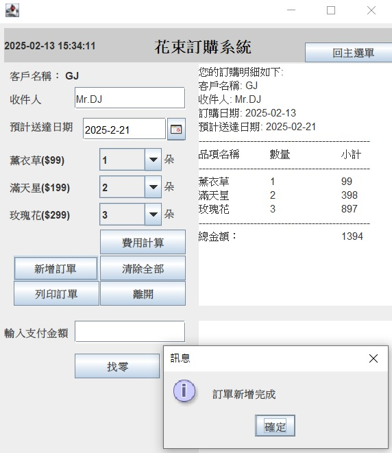
##### 產生訂單明細
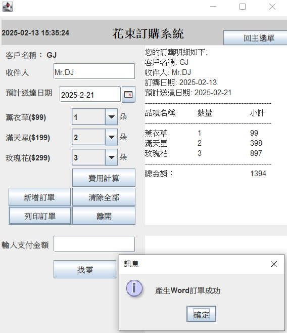
##### 產生Word訂單檔(使用Apache POI套件)
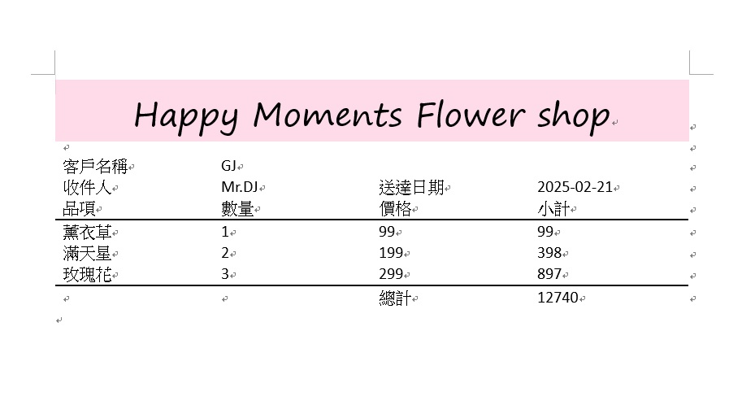
##### 輸入付款金額以及計算找零功能
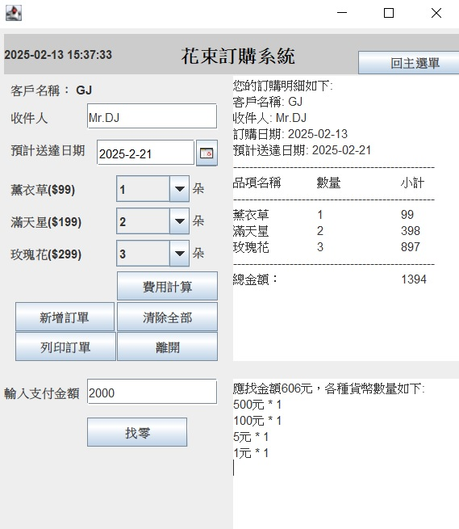

#### 訂單維護
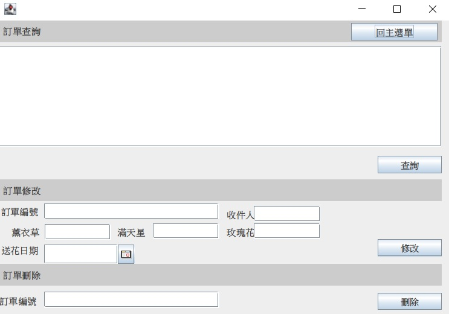
##### 查詢訂單
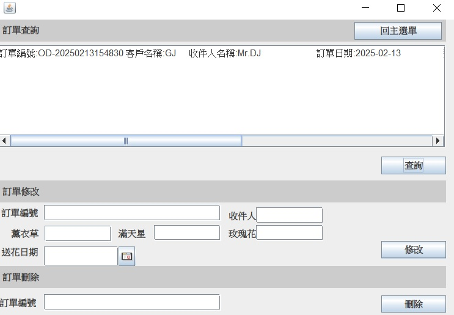
##### 修改訂單
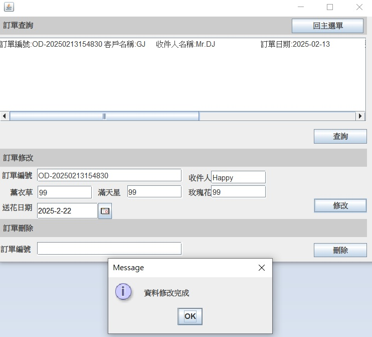
##### 刪除訂單
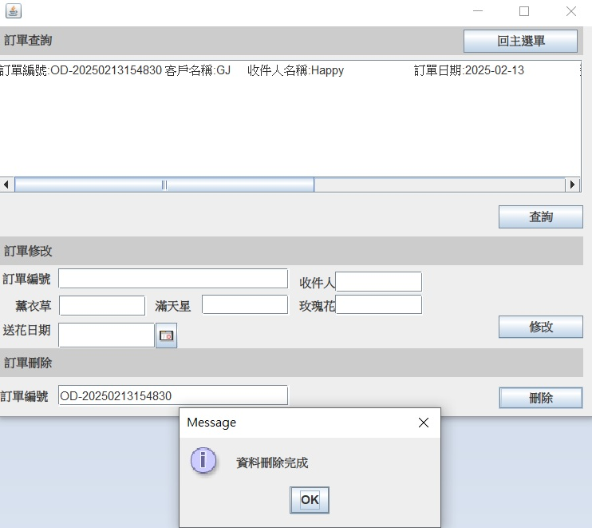
